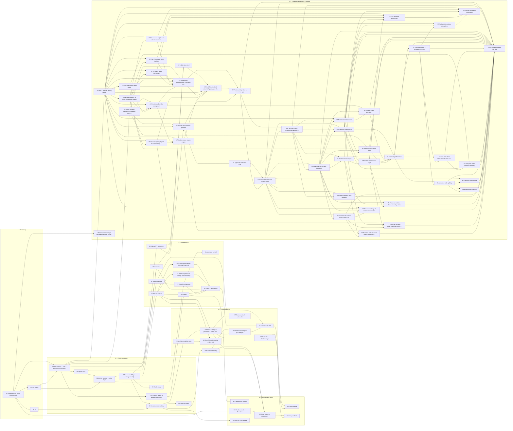

# Tickets — video-pipeline

Tracer-bullet tickets generated from [`PRD.md`](../PRD.md) and [`SDD.md`](../SDD.md) following the `to-tickets` method (Matt Pocock's skills library): each ticket is a **vertical slice** that is demoable on its own and sized for one fresh agent context window; numbering is **dependency order** (blockers always have lower numbers), not priority. Each ticket's `Blocked by` row is authoritative; the `Blocks` rows, the status board, the graph and the lanes below are generated from it by `python3 docs/tickets/gen-index.py` (which also validates every PRD/SDD anchor the tickets link to). Change a ticket's `**Status:**` line and re-run to update the board.

## How to work a ticket (humans and agents)

1. Pick any ticket whose blockers are all `done` (the **frontier**). Prefer the lowest number in the current phase; parallel work is fine across lanes.
2. Read the ticket, then **only** the PRD/SDD sections it links. Do not read the whole SDD — the links are the context budget.
3. Create a branch `ticket/NN-slug`. Implement the *whole* slice: schema → code → tests → docs. Keep `.env.example`, `packages/job-contracts` and the SDD in sync if you touch them (the drift tests will tell you).
4. Every acceptance criterion becomes a test or a recorded demo (screenshot/GIF/result table in the PR).
5. PR checklist & Definition of Done:
   - All AC ticked with verifiable evidence.
   - Tests green under Node **and** Bun where the worker or shared packages are involved.
   - **Green CI in Definition of Done (Strict Barrier):** All CI workflow checks (`lint-typecheck`, `unit`, `unit-bun`, `integration`, `e2e-smoke`) MUST pass green on GitHub Actions before any ticket is marked `done` or merged. A PR or review may be prepared, but reviewers (or the implementing agent) MUST raise a blocking issue if any CI check fails, and strictly forbid merging or finishing any ticket with failing CI checks.
   - No new external runtime dependency (local-first, SDD P9 / PRD G11).
   - **Documentation, Architecture & README in DoD:** `README.md`, `ARCHITECTURE.md`, and `docs/SDD.md` (and relevant ADRs) MUST be updated if any feature, command, boundary, contract, workspace package, schema, or architecture decision is added or changed. Keep `README.md` accurate, professional, human-written, and continuously improved.
   - Ticket `**Status:**` set to `done`, `python3 docs/tickets/gen-index.py` re-run, and changes synced to GitHub Issues / Project board via CI or `pnpm sync:tickets`.
6. Found a decision the ticket doesn't cover? Don't guess silently: pick the option most consistent with the SDD ADRs, write it into the ticket's *Open questions* as "Decided: …", and flag it in the PR.

**Sizes:** S ≈ half a session · M ≈ one session · L ≈ one long session (still one context window if you follow the links only).

## Status board

| # | Ticket | Phase | Size | Blocked by | Blocks | Status |
|---|---|---|---|---|---|---|
| 01 | [Repo skeleton + local infrastructure (`make up && pnpm test` green on a fresh clone)](01-repo-skeleton-local-infra.md) | 0 | M (one focused session) | — | 02, 03, 04, 31, 48 | done |
| 02 | [CI with real service containers, Node and Bun test jobs, Renovate](02-ci-dual-runtime.md) | 0 | M | 01 | 08 | done |
| 03 | [Dev tooling — deterministic video fixtures, dev JWT issuer, hls.js test page](03-dev-tooling-fixtures-token-testpage.md) | 0 | M | 01 | 04, 06 | done |
| 04 | [API skeleton + auth + full database schema — `GET /v1/videos/:id` returns a video](04-api-skeleton-auth-schema-get-video.md) | 1 | L (largest foundation slice; still one session if the DDL is copied from the SDD) | 01, 03 | 05, 10, 15, 19, 37, 38 | done |
| 05 | [Upload slice — single presigned PUT → complete + verify → `UPLOADED` → `probe` job enqueued](05-single-put-upload-complete-enqueue.md) | 1 | M | 04 | 06, 11 | done |
| 06 | [Worker runtime + `probe` stage — good files become `PROCESSING`, hostile files become `FAILED`](06-worker-runtime-probe-stage.md) | 1 | L | 05, 03 | 07, 17 | done |
| 07 | [`transcode-720p` + `package` + `notify` — a video becomes `READY` and plays in the test page](07-transcode-720p-package-notify-playable.md) | 1 | L | 06 | 08, 09, 12, 15 | done |
| 08 | [Containerise everything — `make up-all && make smoke` from a fresh clone (Phase 1 exit)](08-containerise-compose-smoke-images.md) | 1 | M | 07, 02 | 21, 25, 34, 35 | done |
| 09 | [Crash safety — kill a worker mid-transcode; the video still becomes `READY` exactly once](09-crash-safety-effectively-once.md) | 1 | S–M | 07 | — | done |
| 10 | [Bull Board queue UI behind admin auth](10-bull-board-admin-auth.md) | 1 | S | 04 | 16 | done |
| 11 | [Multipart upload with resume and abort — a 4 GB file survives a client crash at 50 %](11-multipart-upload-resume-abort.md) | 2 | M–L | 05 | 17, 28 | done |
| 12 | [Fan-out / fan-in with BullMQ Flows — 1080p / 720p / 480p renditions and a multi-variant master](12-ladder-flows-fanout-fanin.md) | 2 | L | 07 | 13, 14, 16, 22, 23 | done |
| 13 | [Thumbnails as a non-blocking Flow child — poster, sprite sheet and WebVTT](13-thumbnails-flow-child.md) | 2 | S–M | 12 | 20 | done |
| 14 | [Stream segments to storage while encoding — 30-minute sources with bounded disk, aligned keyframes, thread back-off](14-segment-streaming-uploader-disk-bounds.md) | 2 | M–L | 12 | 20 | done |
| 15 | [Live status — workers publish progress, clients subscribe via SSE with snapshot, replay and heartbeat](15-sse-progress-events.md) | 2 | M–L | 07, 04 | 20, 36 | done |
| 16 | [Retries with backoff, Dead-Letter Queue with Postgres mirror, admin replay/discard, re-process with generations](16-retries-dlq-admin-replay-reprocess.md) | 2 | L | 12, 10 | 20, 30 | done |
| 17 | [Housekeeping stage — schedulers, upload/processing reconcilers, soft delete and object purge](17-housekeeping-reconciler-purge.md) | 2 | M | 11, 06 | 18, 20 | done |
| 18 | [Admission control and priorities — one heavy user cannot starve the others](18-admission-control-priorities.md) | 2 | S | 17 | — | done |
| 19 | [Videos API completion — paginated list, metadata edits with optimistic locking, visibility, OpenAPI + contract tests](19-videos-api-completion-openapi.md) | 2 | M | 04 | 36, 50 | done |
| 20 | [Phase 2 acceptance — pipeline E2E suite with the hostile set (20 concurrent videos, all terminal in 15 min)](20-phase2-acceptance-e2e-suite.md) | 2 | M | 13, 14, 15, 16, 17 | 28 | done |
| 21 | [Local observability stack — Prometheus, Grafana, Tempo, Loki, OTel collector as a compose profile](21-observability-stack-local.md) | 3 | M | 08 | 22, 23 | done |
| 22 | [Metrics catalogue populated + queue poller + Grafana dashboards (Pipeline, Queues, Workers, API, Storage & Cost)](22-metrics-catalogue-dashboards.md) | 3 | L | 21, 12 | 24, 26, 27, 32 | done |
| 23 | [OpenTelemetry tracing end-to-end — one trace from `complete` through every worker stage](23-otel-tracing-e2e.md) | 3 | M | 21, 12 | — | done |
| 24 | [Alert rules + Alertmanager — forcing a DLQ entry pages you](24-alert-rules-alertmanager.md) | 3 | S–M | 22 | 29, 33 | done |
| 25 | [Kubernetes locally — Kustomize base + k3d overlay, Helm values; the smoke test passes on a cluster](25-kubernetes-local-k3d.md) | 3 | L | 08 | 26, 32 | done |
| 26 | [KEDA autoscaling on queue depth with safe scale-in — the 0 → N → 0 proof graph](26-keda-autoscaling-graceful-shutdown.md) | 3 | M–L | 25, 22 | 28 | done |
| 27 | [Compose-level autoscaler — the same control loop without Kubernetes](27-compose-autoscaler.md) | 3 | S | 22 | — | done |
| 28 | [Load tests S1–S3 (upload storm, large file, backlog burst) with thresholds, nightly smoke, results README](28-k6-s1-s3-nightly-load-smoke.md) | 3 | L | 11, 20, 26 | 29 | done |
| 29 | [Chaos tooling and scenarios S4–S7 — worker kills, dependency outages, SSE fan-out, soak](29-chaos-tooling-k6-s4-s7.md) | 4 | L | 28, 24 | — | done |
| 30 | [Transactional outbox — close the DB-commit-then-enqueue window](30-transactional-outbox.md) | 4 | M | 16 | — | done |
| 31 | [Cloud accounts + Terraform — Cloudflare (R2, DNS, Tunnel, Access), Hetzner/Oracle, Neon, Grafana Cloud](31-cloud-accounts-terraform.md) | 4 | M | 01 | 32 | done |
| 32 | [Cloud reference deployment — k3s + Neon + R2/CDN + Tunnel + Grafana Cloud; a public URL plays a video for ≤ €6.5/month](32-cloud-overlay-deploy.md) | 4 | L | 25, 22, 31 | 33 | done |
| 33 | [Cost guardrails and runbooks — budget alerts, retention, five operator runbooks](33-cost-guardrails-runbooks.md) | 4 | S–M | 32, 24 | — | done |
| 34 | [Node 26 LTS upgrade and dependency refresh (after 2026-10-28)](34-node26-upgrade-deps.md) | 4 | S | 08 | — | blocked-by-date |
| 35 | [Local-first proof — the whole system runs with zero external services and no internet (Phase 1 exit criterion)](35-local-first-offline-mode.md) | 1 | S–M | 08 | — | done |
| 36 | [Public video feed — unauthenticated browse, detail, and SSE for public videos](36-public-video-feed-api.md) | 5 | M | 19, 15 | 49 | ready |
| 37 | [Admin category management & public cached category API](37-admin-category-management-cached-api.md) | 5 | M | 04 | 44, 45, 50, 61 | ready |
| 38 | [User & channel identity profile with universal OIDC/JWKS provider](38-user-channel-identity-universal-auth.md) | 5 | L | 04 | 39, 40, 41, 42, 43, 44, 45, 46, 47, 49, 50, 56, 72, 76, 77, 78 | ready |
| 39 | [Declarative RBAC & ABAC permission engine (can(user, action, resource))](39-declarative-rbac-abac-permission-engine.md) | 5 | M | 38 | 40, 41, 42, 44, 45, 46, 61 | blocked |
| 40 | [High-throughput video reactions (likes/dislikes) & counter caching](40-high-throughput-video-reactions-counter-caching.md) | 5 | M | 38, 39 | 45, 76 | blocked |
| 41 | [Channel subscriptions & subscribed channels video feed](41-channel-subscriptions-subscriber-feed.md) | 5 | M | 38, 39 | 45, 78 | blocked |
| 42 | [Threaded video comments with keyset pagination & moderation](42-threaded-comments-keyset-pagination-moderation.md) | 5 | L | 38, 39 | 45, 76 | blocked |
| 43 | [High-scale video views buffer (Redis batch flush) & creator studio analytics](43-high-scale-video-views-buffer-reconciler.md) | 5 | L | 38 | 44, 45, 65 | blocked |
| 44 | [Creator studio video management (metadata, thumbnails, visibility & admin overrides)](44-creator-studio-video-management-visibility.md) | 5 | M | 37, 38, 39, 43 | 45, 47, 60 | blocked |
| 45 | [Frontend API modernization & contract alignment — migrate web app to clean canonical `/v1` APIs](45-legacy-frontend-compatibility-adapter-layer.md) | 5 | L | 37, 38, 39, 40, 41, 42, 43, 44 | 49, 52 | blocked |
| 46 | [YouTube-grade playlists & watch history domain engine (Public/private, Watch Later, drag-and-drop reorder & resume sync)](46-youtube-playlists-watch-history-engine.md) | 5 | L | 38, 39 | 47, 49, 73 | blocked |
| 47 | [Multi-resource search engine — unified weighted full-text search across videos, channels & playlists with Redis caching](47-multi-resource-search-engine.md) | 5 | L | 38, 44, 46 | 49, 74 | blocked |
| 48 | [Complete monorepo rebrand & package namespace unification (@vp/ -> @taitube/, services, Docker & CLI)](48-project-rebrand-cli-unification.md) | 5 | L | 01 | — | ready |
| 49 | [Next-Gen frontend direct API gateway & CORS profile for Taitube](49-nextgen-frontend-api-gateway-bootstrap.md) | 5 | M | 36, 38, 45, 46, 47 | 52 | blocked |
| 50 | [Shared API contracts package (`@taitube/api-contracts`) & automated OpenAPI TypeScript codegen](50-shared-api-contracts-zod-openapi-codegen.md) | 5 | M | 19, 37, 38 | 51, 52 | blocked |
| 51 | [Type-safe API client SDK (`@taitube/api-client`) with auto-generated TanStack Query hooks](51-type-safe-query-client-tanstack-react-hooks.md) | 5 | M | 50 | 53 | blocked |
| 52 | [Frontend integration as monorepo app (`apps/web`) with shared contracts & unified DX](52-integrate-frontend-pnpm-monorepo-app-web.md) | 5 | L | 45, 49, 50 | 53, 54, 75 | blocked |
| 53 | [Frontend architecture modernization — TanStack suite (Query, Form, Table), typed API client & state cleanup](53-frontend-architecture-modernization-tanstack-query.md) | 5 | L | 51, 52 | 54, 55, 57, 67, 68, 69, 70, 72, 75 | blocked |
| 54 | [Frontend testing infrastructure & integration suite (Vitest 3, Testing Library & MSW mock API)](54-frontend-testing-trophy-vitest-msw-integration-suite.md) | 5 | M | 52, 53 | 55, 56, 57, 58, 70, 75 | blocked |
| 55 | [Modern design system foundation — Tailwind CSS v4, Radix UI primitives & theme engine](55-design-system-tailwind-radix-dark-theme.md) | 5 | L | 53, 54 | 56, 57, 58, 60, 61, 69, 70, 71, 72, 75 | blocked |
| 56 | [Frontend universal auth, session security & XSS / token hardening](56-frontend-universal-auth-session-security.md) | 5 | M | 38, 54, 55 | 60, 61, 75 | blocked |
| 57 | [Production video player — YouTube-grade player (Vidstack, Ambient Glow, Storyboard Scrubbing, Cinema & Stats for Nerds)](57-production-video-player-hls-streaming-controls.md) | 5 | L | 53, 54, 55 | 59, 62, 65, 73, 75, 76, 77, 78 | blocked |
| 58 | [Modern browse layout — responsive navigation, category pills & video card micro-interactions](58-modern-browse-layout-microinteractions-motion.md) | 5 | M | 54, 55 | 59, 62, 71, 74, 75 | blocked |
| 59 | [Modern video watch page — dynamic 2-column layout, interactive engagement bar & threaded comments UI](59-video-watch-page-responsive-layout-enhancements.md) | 5 | L | 57, 58 | 62, 71, 73, 75, 76 | blocked |
| 60 | [Creator studio dashboard — video library, analytics charts & upload modal](60-creator-studio-dashboard-video-management-ui.md) | 5 | L | 44, 55, 56 | 62, 75 | blocked |
| 61 | [Administrator control panel — dynamic category manager, queue health & moderation UI](61-admin-control-panel-category-moderation-ui.md) | 5 | M | 37, 39, 55, 56 | 62, 75 | blocked |
| 62 | [Frontend performance, list virtualization & production bundle hardening](62-frontend-performance-virtualization-ssr-bundle-hardening.md) | 5 | L | 57, 58, 59, 60, 61 | 63, 64, 66, 75 | blocked |
| 63 | [TanStack Router & TanStack Start SSR — SEO, dynamic OpenGraph & video streaming metadata](63-tanstack-router-start-ssr-seo-streaming.md) | 5 | L | 62 | 64, 66, 75, 77 | blocked |
| 64 | [Core Web Vitals optimization & real-user measurement (LCP, INP, CLS & OpenTelemetry web traces)](64-web-vitals-monitoring-inp-lcp-cls-real-user-measurement.md) | 5 | M | 62, 63 | 65, 75 | blocked |
| 65 | [First-party video playback telemetry, QoS & creator audience analytics beacon](65-first-party-video-playback-telemetry-analytics-beacon.md) | 5 | M | 43, 57, 64 | 75 | blocked |
| 66 | [Advanced code splitting, granular chunking & asset lazy loading](66-advanced-code-splitting-dynamic-chunking-lazy-loading.md) | 5 | M | 62, 63 | 67, 68, 75 | blocked |
| 67 | [Intelligent pre-fetching, viewport-triggered queries & Service Worker asset cache](67-intelligent-prefetch-lazy-fetching-service-worker-cache.md) | 5 | M | 53, 66 | 75 | blocked |
| 68 | [Progressive Web App (PWA) & Service Worker — offline experience, asset caching & background sync](68-pwa-service-worker-offline-cache-background-sync.md) | 5 | L | 53, 66 | 75 | blocked |
| 69 | [Frontend URL-driven state architecture — search params sync, modal deep-linking (STS pattern) & typesafe routing](69-frontend-url-state-search-params-modal-routing.md) | 5 | M | 53, 55 | 72, 73, 74, 75 | blocked |
| 70 | [Frontend resilient error handling — RFC 9457 error pages, classified query retry policies & contextual view fallbacks](70-frontend-resilient-error-handling-retry-policy.md) | 5 | M | 53, 54, 55 | 75 | blocked |
| 71 | [Frontend skeleton shimmer loading states — layout-stable placeholders for primary views (CLS < 0.05)](71-frontend-skeleton-shimmer-loading-states.md) | 5 | M | 55, 58, 59 | 75 | blocked |
| 72 | [Extensive settings & customization system — themes, playback preferences, privacy toggles & channel branding](72-frontend-settings-customization-system.md) | 5 | M | 38, 53, 55, 69 | 75 | blocked |
| 73 | [Frontend YouTube-grade playlist & watch history library — watch history feed, playlist manager & player queue tray](73-frontend-youtube-playlists-library-player-queue.md) | 5 | L | 46, 57, 59, 69 | 75 | blocked |
| 74 | [Frontend multi-resource search & discovery UI — polymorphic results, filter chips & auto-complete suggestions](74-frontend-multi-resource-search-discovery-ui.md) | 5 | M | 47, 58, 69 | 75 | blocked |
| 75 | [Full-stack Playwright E2E suite, security validation & end-to-end performance benchmarking](75-fullstack-e2e-playwright-security-perf-validation.md) | 5 | L | 52, 53, 54, 55, 56, 57, 58, 59, 60, 61, 62, 63, 64, 65, 66, 67, 68, 69, 70, 71, 72, 73, 74 | — | blocked |
| 76 | [Live streaming architecture — RTMP/WHIP ingestion, low-latency HLS packaging & real-time chat sidecar](76-live-streaming-rtmp-whip-llhls-packaging-chat.md) | 5 | L | 38, 40, 42, 57, 59 | 78 | blocked |
| 77 | [Platform integrations ecosystem — oEmbed provider, embeddable iframe player, Discord/Twitter rich unfurls & webhooks](77-platform-integrations-oembed-embed-player-webhooks.md) | 5 | M | 38, 57, 63 | 78 | blocked |
| 78 | [Discord integration ecosystem — Taitube Discord bot, Watch Together voice activity, creator alerts & community role sync](78-discord-integration-bot-watch-together-activity-creator-alerts.md) | 5 | L | 38, 41, 57, 76, 77 | — | blocked |

> Board statuses derive from each ticket's `**Status:**` line: `ready` = all blockers done (the frontier) · `blocked` · `in-progress` · `done` · `blocked-by-date` (34 waits for Node 26 LTS on 2026-10-28).

## Dependency graph



## Parallel lanes (frontier levels)

Tickets in the same level have all their blockers in earlier levels, so they can run in parallel once the previous level is done — the schedule for several agents working at once.

| Level | Tickets (can run in parallel) |
|---|---|
| 0 | [01](01-repo-skeleton-local-infra.md) Repo skeleton + local infrastructure |
| 1 | [02](02-ci-dual-runtime.md) CI · [03](03-dev-tooling-fixtures-token-testpage.md) Dev tooling · [31](31-cloud-accounts-terraform.md) Cloud accounts + Terraform · [48](48-project-rebrand-cli-unification.md) Complete monorepo rebrand & package name… |
| 2 | [04](04-api-skeleton-auth-schema-get-video.md) API skeleton + auth + full database schema |
| 3 | [05](05-single-put-upload-complete-enqueue.md) Upload slice · [10](10-bull-board-admin-auth.md) Bull Board queue UI behind admin auth · [19](19-videos-api-completion-openapi.md) Videos API completion · [37](37-admin-category-management-cached-api.md) Admin category management & public cache… · [38](38-user-channel-identity-universal-auth.md) User & channel identity profile |
| 4 | [06](06-worker-runtime-probe-stage.md) Worker runtime + probe stage · [11](11-multipart-upload-resume-abort.md) Multipart upload · [39](39-declarative-rbac-abac-permission-engine.md) Declarative RBAC & ABAC permission engine · [43](43-high-scale-video-views-buffer-reconciler.md) High-scale video views buffer · [50](50-shared-api-contracts-zod-openapi-codegen.md) Shared API contracts package |
| 5 | [07](07-transcode-720p-package-notify-playable.md) transcode-720p + package + notify · [17](17-housekeeping-reconciler-purge.md) Housekeeping stage · [40](40-high-throughput-video-reactions-counter-caching.md) High-throughput video reactions · [41](41-channel-subscriptions-subscriber-feed.md) Channel subscriptions & subscribed chann… · [42](42-threaded-comments-keyset-pagination-moderation.md) Threaded video comments · [44](44-creator-studio-video-management-visibility.md) Creator studio video management · [46](46-youtube-playlists-watch-history-engine.md) YouTube-grade playlists & watch history … · [51](51-type-safe-query-client-tanstack-react-hooks.md) Type-safe API client SDK |
| 6 | [08](08-containerise-compose-smoke-images.md) Containerise everything · [09](09-crash-safety-effectively-once.md) Crash safety · [12](12-ladder-flows-fanout-fanin.md) Fan-out / fan-in · [15](15-sse-progress-events.md) Live status · [18](18-admission-control-priorities.md) Admission control · [45](45-legacy-frontend-compatibility-adapter-layer.md) Frontend API modernization & contract al… · [47](47-multi-resource-search-engine.md) Multi-resource search engine |
| 7 | [13](13-thumbnails-flow-child.md) Thumbnails as a non-blocking Flow child · [14](14-segment-streaming-uploader-disk-bounds.md) Stream segments to storage while encoding · [16](16-retries-dlq-admin-replay-reprocess.md) Retries · [21](21-observability-stack-local.md) Local observability stack · [25](25-kubernetes-local-k3d.md) Kubernetes locally · [34](34-node26-upgrade-deps.md) Node 26 LTS upgrade · [35](35-local-first-offline-mode.md) Local-first proof · [36](36-public-video-feed-api.md) Public video feed |
| 8 | [20](20-phase2-acceptance-e2e-suite.md) Phase 2 acceptance · [22](22-metrics-catalogue-dashboards.md) Metrics catalogue populated + queue poll… · [23](23-otel-tracing-e2e.md) OpenTelemetry tracing end-to-end · [30](30-transactional-outbox.md) Transactional outbox · [49](49-nextgen-frontend-api-gateway-bootstrap.md) Next-Gen frontend direct API gateway & C… |
| 9 | [24](24-alert-rules-alertmanager.md) Alert rules + Alertmanager · [26](26-keda-autoscaling-graceful-shutdown.md) KEDA autoscaling on queue depth · [27](27-compose-autoscaler.md) Compose-level autoscaler · [32](32-cloud-overlay-deploy.md) Cloud reference deployment · [52](52-integrate-frontend-pnpm-monorepo-app-web.md) Frontend integration as monorepo app |
| 10 | [28](28-k6-s1-s3-nightly-load-smoke.md) Load tests S1–S3 · [33](33-cost-guardrails-runbooks.md) Cost guardrails · [53](53-frontend-architecture-modernization-tanstack-query.md) Frontend architecture modernization |
| 11 | [29](29-chaos-tooling-k6-s4-s7.md) Chaos tooling · [54](54-frontend-testing-trophy-vitest-msw-integration-suite.md) Frontend testing infrastructure & integr… |
| 12 | [55](55-design-system-tailwind-radix-dark-theme.md) Modern design system foundation |
| 13 | [56](56-frontend-universal-auth-session-security.md) Frontend universal auth · [57](57-production-video-player-hls-streaming-controls.md) Production video player · [58](58-modern-browse-layout-microinteractions-motion.md) Modern browse layout · [69](69-frontend-url-state-search-params-modal-routing.md) Frontend URL-driven state architecture · [70](70-frontend-resilient-error-handling-retry-policy.md) Frontend resilient error handling |
| 14 | [59](59-video-watch-page-responsive-layout-enhancements.md) Modern video watch page · [60](60-creator-studio-dashboard-video-management-ui.md) Creator studio dashboard · [61](61-admin-control-panel-category-moderation-ui.md) Administrator control panel · [72](72-frontend-settings-customization-system.md) Extensive settings & customization system · [74](74-frontend-multi-resource-search-discovery-ui.md) Frontend multi-resource search & discove… |
| 15 | [62](62-frontend-performance-virtualization-ssr-bundle-hardening.md) Frontend performance · [71](71-frontend-skeleton-shimmer-loading-states.md) Frontend skeleton shimmer loading states · [73](73-frontend-youtube-playlists-library-player-queue.md) Frontend YouTube-grade playlist & watch … · [76](76-live-streaming-rtmp-whip-llhls-packaging-chat.md) Live streaming architecture |
| 16 | [63](63-tanstack-router-start-ssr-seo-streaming.md) TanStack Router & TanStack Start SSR |
| 17 | [64](64-web-vitals-monitoring-inp-lcp-cls-real-user-measurement.md) Core Web Vitals optimization & real-user… · [66](66-advanced-code-splitting-dynamic-chunking-lazy-loading.md) Advanced code splitting · [77](77-platform-integrations-oembed-embed-player-webhooks.md) Platform integrations ecosystem |
| 18 | [65](65-first-party-video-playback-telemetry-analytics-beacon.md) First-party video playback telemetry · [67](67-intelligent-prefetch-lazy-fetching-service-worker-cache.md) Intelligent pre-fetching · [68](68-pwa-service-worker-offline-cache-background-sync.md) Progressive Web App · [78](78-discord-integration-bot-watch-together-activity-creator-alerts.md) Discord integration ecosystem |
| 19 | [75](75-fullstack-e2e-playwright-security-perf-validation.md) Full-stack Playwright E2E suite |

## Suggested single-developer order

01 → 02 · 03 → 04 → 05 → 06 → 07 → 08 → **35** (offline proof) → 09 · 10 → 12 → 13 · 14 · 15 · 11 → 16 → 17 → 18 · 19 → 20 → 21 → 22 · 23 → 24 → 25 → 26 · 27 → 28 → 31 (any time) → 29 · 30 → 32 → 33 → 34 (after 2026-10-28).

## Phase exits

| Phase | Exit ticket(s) | Tag |
|---|---|---|
| 0 Bootstrap | 01, 02, 03 | `phase0-start` |
| 1 Walking skeleton | 08 + 35 (and 09) | `phase1-done` |
| 2 Real pipeline | 20 | `phase2-done` |
| 3 Observe & scale | 26 + 28 | `phase3-done` |
| 4 Resilience & cloud | 29 + 32 + 33 | `phase4-cloud` |

## Backlog (Phase 5, not ticketed yet — see SDD §18 Phase 5)

| Candidate | Spec pointer | Would be blocked by |
|---|---|---|
| Chunked parallel transcoding (split at keyframes, transcode chunks concurrently, concat) | [SDD §8.5](../SDD.md#85-chunked-parallel-transcoding-phase-4-stretch-designed-not-built), [ADR-08](../SDD.md#adr-08-transcode-parallelism-one-job-per-rendition-fan-out-chunked-transcoding-as-stretch) | 14, 28 |
| CMAF/fMP4 segments + DASH manifest from one segment set | [ADR-07](../SDD.md#adr-07-delivery-format-hls-with-mpeg-ts-segments-mvp-cmaffmp4-upgrade-path) | 12 |
| `apps/worker-go` sibling consuming the same queues | [ADR-01](../SDD.md#adr-01-primary-language-runtime-typescript-node-lts-api-bun-workers), [ADR-11](../SDD.md#adr-11-repository-topology-modular-monorepo-multiple-deployables-one-worker-image) | 20 |
| RabbitMQ implementation of the same topology (comparative write-up) | [ADR-03](../SDD.md#adr-03-message-broker-bullmq-6-on-redis-task-queue-with-postgres-video_events-as-the-append-only-log) | 20 |
| Signed playback URLs / private videos via CDN | [PRD OQ-2](../PRD.md#12-open-questions-to-resolve-during-phase-01) | 32 |
| Redpanda tail of `video_events` for a search indexer | [ADR-03 hybrid verdict](../SDD.md#adr-03-message-broker-bullmq-6-on-redis-task-queue-with-postgres-video_events-as-the-append-only-log) | 30 |
| Frontend integration with `youtube-frontend` (upload widget, SSE progress, hls.js player using `SseEvent` types) | [PRD §1](../PRD.md#1-summary) | 19, 15 |

## Ticket template

```markdown
# NN: <Title — the behaviour it makes work>

| Field | Value |
|---|---|
| Phase | <0–4 — name> |
| Size | S / M / L |
| Blocked by | <NN — short title, …> or None (can start immediately) |
| Blocks | _auto_ |
| Spec | [PRD …](../PRD.md#…) · [SDD …](../SDD.md#…) |

**Status:** ready-for-agent

## What to build
End-to-end behaviour from the user's/operator's perspective — not a layer list.

## Acceptance criteria
- [ ] …

## Out of scope
## Notes for the implementer   (decision-rich only; no file paths that go stale beyond the package names fixed in SDD §15.1)
## Testing plan
## Open questions
## Definition of Done
```
