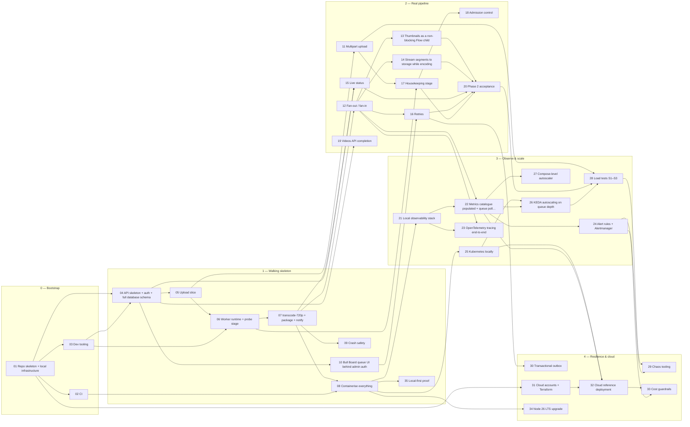

# Tickets — video-pipeline

Tracer-bullet tickets generated from [`PRD.md`](../PRD.md) and [`SDD.md`](../SDD.md) following the `to-tickets` method (Matt Pocock's skills library): each ticket is a **vertical slice** that is demoable on its own and sized for one fresh agent context window; numbering is **dependency order** (blockers always have lower numbers), not priority. Each ticket's `Blocked by` row is authoritative; the `Blocks` rows, the status board, the graph and the lanes below are generated from it by `python3 docs/tickets/gen-index.py` (which also validates every PRD/SDD anchor the tickets link to). Change a ticket's `**Status:**` line and re-run to update the board.

## How to work a ticket (humans and agents)

1. Pick any ticket whose blockers are all `done` (the **frontier**). Prefer the lowest number in the current phase; parallel work is fine across lanes.
2. Read the ticket, then **only** the PRD/SDD sections it links. Do not read the whole SDD — the links are the context budget.
3. Create a branch `ticket/NN-slug`. Implement the *whole* slice: schema → code → tests → docs. Keep `.env.example`, `packages/job-contracts` and the SDD in sync if you touch them (the drift tests will tell you).
4. Every acceptance criterion becomes a test or a recorded demo (screenshot/GIF/result table in the PR).
5. PR checklist: AC ticked · tests green under Node **and** Bun where the worker is involved · no new external runtime dependency (local-first, SDD P9 / PRD G11) · SDD/PRD updated if a decision changed · ticket `**Status:**` set to `done` and `gen-index.py` re-run.
6. Found a decision the ticket doesn't cover? Don't guess silently: pick the option most consistent with the SDD ADRs, write it into the ticket's *Open questions* as "Decided: …", and flag it in the PR.

**Sizes:** S ≈ half a session · M ≈ one session · L ≈ one long session (still one context window if you follow the links only).

## Status board

| # | Ticket | Phase | Size | Blocked by | Blocks | Status |
|---|---|---|---|---|---|---|
| 01 | [Repo skeleton + local infrastructure (`make up && pnpm test` green on a fresh clone)](01-repo-skeleton-local-infra.md) | 0 | M (one focused session) | — | 02, 03, 04, 31 | done |
| 02 | [CI with real service containers, Node and Bun test jobs, Renovate](02-ci-dual-runtime.md) | 0 | M | 01 | 08 | done |
| 03 | [Dev tooling — deterministic video fixtures, dev JWT issuer, hls.js test page](03-dev-tooling-fixtures-token-testpage.md) | 0 | M | 01 | 04, 06 | done |
| 04 | [API skeleton + auth + full database schema — `GET /v1/videos/:id` returns a video](04-api-skeleton-auth-schema-get-video.md) | 1 | L (largest foundation slice; still one session if the DDL is copied from the SDD) | 01, 03 | 05, 10, 15, 19 | done |
| 05 | [Upload slice — single presigned PUT → complete + verify → `UPLOADED` → `probe` job enqueued](05-single-put-upload-complete-enqueue.md) | 1 | M | 04 | 06, 11 | done |
| 06 | [Worker runtime + `probe` stage — good files become `PROCESSING`, hostile files become `FAILED`](06-worker-runtime-probe-stage.md) | 1 | L | 05, 03 | 07, 17 | done |
| 07 | [`transcode-720p` + `package` + `notify` — a video becomes `READY` and plays in the test page](07-transcode-720p-package-notify-playable.md) | 1 | L | 06 | 08, 09, 12, 15 | done |
| 08 | [Containerise everything — `make up-all && make smoke` from a fresh clone (Phase 1 exit)](08-containerise-compose-smoke-images.md) | 1 | M | 07, 02 | 21, 25, 34, 35 | done |
| 09 | [Crash safety — kill a worker mid-transcode; the video still becomes `READY` exactly once](09-crash-safety-effectively-once.md) | 1 | S–M | 07 | — | done |
| 10 | [Bull Board queue UI behind admin auth](10-bull-board-admin-auth.md) | 1 | S | 04 | 16 | done |
| 11 | [Multipart upload with resume and abort — a 4 GB file survives a client crash at 50 %](11-multipart-upload-resume-abort.md) | 2 | M–L | 05 | 17, 28 | done |
| 12 | [Fan-out / fan-in with BullMQ Flows — 1080p / 720p / 480p renditions and a multi-variant master](12-ladder-flows-fanout-fanin.md) | 2 | L | 07 | 13, 14, 16, 22, 23 | done |
| 13 | [Thumbnails as a non-blocking Flow child — poster, sprite sheet and WebVTT](13-thumbnails-flow-child.md) | 2 | S–M | 12 | 20 | done |
| 14 | [Stream segments to storage while encoding — 30-minute sources with bounded disk, aligned keyframes, thread back-off](14-segment-streaming-uploader-disk-bounds.md) | 2 | M–L | 12 | 20 | done |
| 15 | [Live status — workers publish progress, clients subscribe via SSE with snapshot, replay and heartbeat](15-sse-progress-events.md) | 2 | M–L | 07, 04 | 20 | done |
| 16 | [Retries with backoff, Dead-Letter Queue with Postgres mirror, admin replay/discard, re-process with generations](16-retries-dlq-admin-replay-reprocess.md) | 2 | L | 12, 10 | 20, 30 | done |
| 17 | [Housekeeping stage — schedulers, upload/processing reconcilers, soft delete and object purge](17-housekeeping-reconciler-purge.md) | 2 | M | 11, 06 | 18, 20 | done |
| 18 | [Admission control and priorities — one heavy user cannot starve the others](18-admission-control-priorities.md) | 2 | S | 17 | — | done |
| 19 | [Videos API completion — paginated list, metadata edits with optimistic locking, visibility, OpenAPI + contract tests](19-videos-api-completion-openapi.md) | 2 | M | 04 | — | done |
| 20 | [Phase 2 acceptance — pipeline E2E suite with the hostile set (20 concurrent videos, all terminal in 15 min)](20-phase2-acceptance-e2e-suite.md) | 2 | M | 13, 14, 15, 16, 17 | 28 | done |
| 21 | [Local observability stack — Prometheus, Grafana, Tempo, Loki, OTel collector as a compose profile](21-observability-stack-local.md) | 3 | M | 08 | 22, 23 | done |
| 22 | [Metrics catalogue populated + queue poller + Grafana dashboards (Pipeline, Queues, Workers, API, Storage & Cost)](22-metrics-catalogue-dashboards.md) | 3 | L | 21, 12 | 24, 26, 27, 32 | done |
| 23 | [OpenTelemetry tracing end-to-end — one trace from `complete` through every worker stage](23-otel-tracing-e2e.md) | 3 | M | 21, 12 | — | done |
| 24 | [Alert rules + Alertmanager — forcing a DLQ entry pages you](24-alert-rules-alertmanager.md) | 3 | S–M | 22 | 29, 33 | ready |
| 25 | [Kubernetes locally — Kustomize base + k3d overlay, Helm values; the smoke test passes on a cluster](25-kubernetes-local-k3d.md) | 3 | L | 08 | 26, 32 | ready |
| 26 | [KEDA autoscaling on queue depth with safe scale-in — the 0 → N → 0 proof graph](26-keda-autoscaling-graceful-shutdown.md) | 3 | M–L | 25, 22 | 28 | blocked |
| 27 | [Compose-level autoscaler — the same control loop without Kubernetes](27-compose-autoscaler.md) | 3 | S | 22 | — | in-progress |
| 28 | [Load tests S1–S3 (upload storm, large file, backlog burst) with thresholds, nightly smoke, results README](28-k6-s1-s3-nightly-load-smoke.md) | 3 | L | 11, 20, 26 | 29 | blocked |
| 29 | [Chaos tooling and scenarios S4–S7 — worker kills, dependency outages, SSE fan-out, soak](29-chaos-tooling-k6-s4-s7.md) | 4 | L | 28, 24 | — | blocked |
| 30 | [Transactional outbox — close the DB-commit-then-enqueue window](30-transactional-outbox.md) | 4 | M | 16 | — | ready |
| 31 | [Cloud accounts + Terraform — Cloudflare (R2, DNS, Tunnel, Access), Hetzner/Oracle, Neon, Grafana Cloud](31-cloud-accounts-terraform.md) | 4 | M | 01 | 32 | ready |
| 32 | [Cloud reference deployment — k3s + Neon + R2/CDN + Tunnel + Grafana Cloud; a public URL plays a video for ≤ €6.5/month](32-cloud-overlay-deploy.md) | 4 | L | 25, 22, 31 | 33 | blocked |
| 33 | [Cost guardrails and runbooks — budget alerts, retention, five operator runbooks](33-cost-guardrails-runbooks.md) | 4 | S–M | 32, 24 | — | blocked |
| 34 | [Node 26 LTS upgrade and dependency refresh (after 2026-10-28)](34-node26-upgrade-deps.md) | 4 | S | 08 | — | blocked-by-date |
| 35 | [Local-first proof — the whole system runs with zero external services and no internet (Phase 1 exit criterion)](35-local-first-offline-mode.md) | 1 | S–M | 08 | — | done |

> Board statuses derive from each ticket's `**Status:**` line: `ready` = all blockers done (the frontier) · `blocked` · `in-progress` · `done` · `blocked-by-date` (34 waits for Node 26 LTS on 2026-10-28).

## Dependency graph



## Parallel lanes (frontier levels)

Tickets in the same level have all their blockers in earlier levels, so they can run in parallel once the previous level is done — the schedule for several agents working at once.

| Level | Tickets (can run in parallel) |
|---|---|
| 0 | [01](01-repo-skeleton-local-infra.md) Repo skeleton + local infrastructure |
| 1 | [02](02-ci-dual-runtime.md) CI · [03](03-dev-tooling-fixtures-token-testpage.md) Dev tooling · [31](31-cloud-accounts-terraform.md) Cloud accounts + Terraform |
| 2 | [04](04-api-skeleton-auth-schema-get-video.md) API skeleton + auth + full database schema |
| 3 | [05](05-single-put-upload-complete-enqueue.md) Upload slice · [10](10-bull-board-admin-auth.md) Bull Board queue UI behind admin auth · [19](19-videos-api-completion-openapi.md) Videos API completion |
| 4 | [06](06-worker-runtime-probe-stage.md) Worker runtime + probe stage · [11](11-multipart-upload-resume-abort.md) Multipart upload |
| 5 | [07](07-transcode-720p-package-notify-playable.md) transcode-720p + package + notify · [17](17-housekeeping-reconciler-purge.md) Housekeeping stage |
| 6 | [08](08-containerise-compose-smoke-images.md) Containerise everything · [09](09-crash-safety-effectively-once.md) Crash safety · [12](12-ladder-flows-fanout-fanin.md) Fan-out / fan-in · [15](15-sse-progress-events.md) Live status · [18](18-admission-control-priorities.md) Admission control |
| 7 | [13](13-thumbnails-flow-child.md) Thumbnails as a non-blocking Flow child · [14](14-segment-streaming-uploader-disk-bounds.md) Stream segments to storage while encoding · [16](16-retries-dlq-admin-replay-reprocess.md) Retries · [21](21-observability-stack-local.md) Local observability stack · [25](25-kubernetes-local-k3d.md) Kubernetes locally · [34](34-node26-upgrade-deps.md) Node 26 LTS upgrade · [35](35-local-first-offline-mode.md) Local-first proof |
| 8 | [20](20-phase2-acceptance-e2e-suite.md) Phase 2 acceptance · [22](22-metrics-catalogue-dashboards.md) Metrics catalogue populated + queue poll… · [23](23-otel-tracing-e2e.md) OpenTelemetry tracing end-to-end · [30](30-transactional-outbox.md) Transactional outbox |
| 9 | [24](24-alert-rules-alertmanager.md) Alert rules + Alertmanager · [26](26-keda-autoscaling-graceful-shutdown.md) KEDA autoscaling on queue depth · [27](27-compose-autoscaler.md) Compose-level autoscaler · [32](32-cloud-overlay-deploy.md) Cloud reference deployment |
| 10 | [28](28-k6-s1-s3-nightly-load-smoke.md) Load tests S1–S3 · [33](33-cost-guardrails-runbooks.md) Cost guardrails |
| 11 | [29](29-chaos-tooling-k6-s4-s7.md) Chaos tooling |

## Suggested single-developer order

01 → 02 · 03 → 04 → 05 → 06 → 07 → 08 → **35** (offline proof) → 09 · 10 → 12 → 13 · 14 · 15 · 11 → 16 → 17 → 18 · 19 → 20 → 21 → 22 · 23 → 24 → 25 → 26 · 27 → 28 → 31 (any time) → 29 · 30 → 32 → 33 → 34 (after 2026-10-28).

## Phase exits

| Phase | Exit ticket(s) | Tag |
|---|---|---|
| 0 Bootstrap | 01, 02, 03 | `phase0-start` |
| 1 Walking skeleton | 08 + 35 (and 09) | `phase1-done` |
| 2 Real pipeline | 20 | `phase2-done` |
| 3 Observe & scale | 26 + 28 | `phase3-done` |
| 4 Resilience & cloud | 29 + 32 + 33 | `phase4-cloud` |

## Backlog (Phase 5, not ticketed yet — see SDD §18 Phase 5)

| Candidate | Spec pointer | Would be blocked by |
|---|---|---|
| Chunked parallel transcoding (split at keyframes, transcode chunks concurrently, concat) | [SDD §8.5](../SDD.md#85-chunked-parallel-transcoding-phase-4-stretch-designed-not-built), [ADR-08](../SDD.md#adr-08-transcode-parallelism-one-job-per-rendition-fan-out-chunked-transcoding-as-stretch) | 14, 28 |
| CMAF/fMP4 segments + DASH manifest from one segment set | [ADR-07](../SDD.md#adr-07-delivery-format-hls-with-mpeg-ts-segments-mvp-cmaffmp4-upgrade-path) | 12 |
| `apps/worker-go` sibling consuming the same queues | [ADR-01](../SDD.md#adr-01-primary-language-runtime-typescript-node-lts-api-bun-workers), [ADR-11](../SDD.md#adr-11-repository-topology-modular-monorepo-multiple-deployables-one-worker-image) | 20 |
| RabbitMQ implementation of the same topology (comparative write-up) | [ADR-03](../SDD.md#adr-03-message-broker-bullmq-6-on-redis-task-queue-with-postgres-video_events-as-the-append-only-log) | 20 |
| Signed playback URLs / private videos via CDN | [PRD OQ-2](../PRD.md#12-open-questions-to-resolve-during-phase-01) | 32 |
| Redpanda tail of `video_events` for a search indexer | [ADR-03 hybrid verdict](../SDD.md#adr-03-message-broker-bullmq-6-on-redis-task-queue-with-postgres-video_events-as-the-append-only-log) | 30 |
| Frontend integration with `youtube-frontend` (upload widget, SSE progress, hls.js player using `SseEvent` types) | [PRD §1](../PRD.md#1-summary) | 19, 15 |

## Ticket template

```markdown
# NN: <Title — the behaviour it makes work>

| Field | Value |
|---|---|
| Phase | <0–4 — name> |
| Size | S / M / L |
| Blocked by | <NN — short title, …> or None (can start immediately) |
| Blocks | _auto_ |
| Spec | [PRD …](../PRD.md#…) · [SDD …](../SDD.md#…) |

**Status:** ready-for-agent

## What to build
End-to-end behaviour from the user's/operator's perspective — not a layer list.

## Acceptance criteria
- [ ] …

## Out of scope
## Notes for the implementer   (decision-rich only; no file paths that go stale beyond the package names fixed in SDD §15.1)
## Testing plan
## Open questions
## Definition of Done
```
